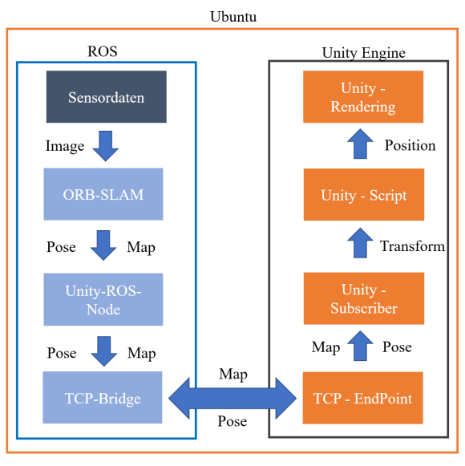

<!-- PROJECT LOGO -->
 

<h3 align="center">
Mixed Reality without HoloLens 
 
Development of a Prototype for SLAM
  

     
     
    <a href="https://github.com/Lakusan/MR_without_HoloLens/blob/main/11012049_Bachelor_Thesis.pdf"><strong>Read Thesis »</strong></a>
     
     
    <a href="https://github.com/Lakusan/MR_without_HoloLens/blob/main/11012049_Kolloquium_Bachelor_Thesis.pdf"><strong>View Presentaion »</strong></a>

<!-- ABOUT THE PROJECT -->
## About

     
    

   This System was developed as part of my Bachelor's Thesis in Virtual Realities at SRH University Heidelberg, from May to September 2021.
    

    

    Abstract:
    

    

        Mixed Reality (MR) mixes physical with virtual reality. The Microsoft HoloLens interprets
        the physical environment through optical sensors and thus realizes spatial computing. Spatial
        Computing comprises the utilization of spatial geometry as input data for algorithms. This
        enables marker-less, inside-out tracking. To do this, however, the HoloLens must be
        localized at the same time as the spatial geometry is interpreted. The problem is known in
        robotics as Simultaneous Localization and Mapping (SLAM). If the robot is replaced by an
        operator with a head-mounted display, solutions for SLAM can also be transferred to MR.
        The aim of this work is to check whether the SLAM problem can also be solved without the
        HoloLens using just one camera. For this purpose, ORB-SLAM2 is identified and
        implemented as a valid visual SLAM solution strategy. To enable the subsequent
        development of an MR application, ORB-SLAM2 is integrated into the Robot Operating
        System (ROS). This enables the connection to the Unity Engine and thus the utilization of
        the SLAM process for the development of MR-capable applications. The successful
        integration of the SLAM process into the Unity Engine could be demonstrated. Subsequent
        tests revealed a difficult initialization phase of the algorithm and the problematic handling of
        pure rotations, which, however, could be minimized by integrating the algorithm in ROS.
        This work shows that MR can also be solved without the HoloLens and Windows Mixed
Reality.
    

<section style="display: grid; grid-template-columns: 1fr; gap: 20px; text-align: center;">

    </img>

</section>
    

<!-- LICENSE -->
## License

Distributed under the MIT License. See `LICENSE.txt` for more information.
 

<!-- CONTACT -->
## Contact

* Project Link: [https://github.com/Lakusan/invisnav](https://github.com/Lakusan/invisnav)
* [![LinkedIn][linkedin-shield]][linkedin-url]

<!-- MARKDOWN LINKS & IMAGES -->
<!-- https://www.markdownguide.org/basic-syntax/#reference-style-links -->
[linkedin-shield]: https://img.shields.io/badge/-LinkedIn-black.svg?style=for-the-badge&logo=linkedin&colorB=555
[linkedin-url]: https://www.linkedin.com/in/lakusan